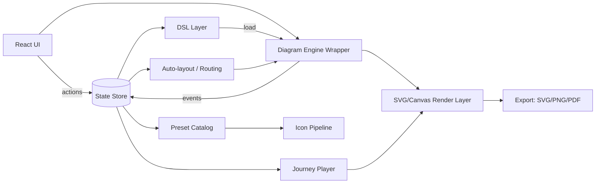

# C4 Editor & Journey Player (Web/React)

## 0) Visão

Construir um editor estilo draw.io/Whimsical **com controle total**, focado em:

* **C4** (System / Container / Component + Boundaries).
* **Diagrama interno por container** (prioridade: **Hexagonal** com PortIn/PortOut/Adapters).
* **Jornadas/fluxos** dentro do mesmo diagrama (numeração automática + cores por jornada).
* **Modo Render/Player**: animação de “energia” nas setas, highlight de nós/edges por passo, confete ao finalizar, loop/velocidade.
* **Drill-down**: double-click em um container abre sua visão de componentes no padrão C4, com breadcrumb.
* Persistência: **sempre salvar a DSL FULL** (com geometria). Também suportar uma DSL LITE (humana) que a UI “opina” e transforma em FULL.

### Princípios

* Engine e modelo desacoplados (UI ↔ Engine ↔ DSL).
* Undo/redo por Command Stack.
* Tudo versionado (schemaVersion) e migrável.
* Sem dependência de libs pagas/fechadas; extensível por plugins.

---

## 1) UX — Layout da Tela (Editor)

### 1.1 Estrutura visual (padrão)

1. **Topbar**

* Nome do diagrama / visão atual (C4: Context, Container, Component) + Breadcrumb.
* Botões: Save/Export, Arrange (auto-layout), Snap/Grid, Player Mode, Zoom.

2. **Left Sidebar: Toolbox/Palette** (estilo draw.io)

* Categorias:

  * C4: System, Container, Component, Boundary.
  * Infra: DB, Cache, Queue/Stream, API Gateway, Auth/OAuth2/Security, Observability.
  * Cloud: AKS/Azure boundary, VNET, Subnet (se fizer sentido), ingress.
  * Hexagonal: Domain, PortIn, PortOut, AdapterIn (REST/gRPC), AdapterOut (DB/Kafka/HTTP), Application Service.
* Sub-painel de **presets**: tecnologia + ícone (Spring Boot, Node, Kafka, Postgres, Redis, Elasticsearch, NGINX, etc.).
* Ferramentas: Select, Hand (pan), Connector, Text/Label.

3. **Canvas**

* Infinite canvas com pan/zoom.
* Grid opcional.
* Snapping opcional (grid + alinhamento a formas).
* Multi-select, marquee select.
* Handles de resize nos retângulos.
* “Ports” (pontos de conexão) nas bordas (N/E/S/W + intermediários) para encaixe de setas.

4. **Right Sidebar: Inspector/Properties**

* Propriedades do elemento selecionado:

  * Tipo (system/container/component/boundary etc.)
  * Título, descrição, tags
  * Tecnologia/preset (ícone + label)
  * Estilo (opcional): cor do cabeçalho, borda, etc.
  * Para edges: protocolo (HTTP/gRPC/Kafka/etc), label, setas, numeração/jornada.

5. **Bottom/Drawer: Journeys (Fluxos)**

* Lista de jornadas (A, B, C…)
* Cor da jornada
* Passos (auto-numeração) — arrastar para reordenar
* “Gerar passos a partir de seleção”: usuário seleciona edges em ordem e vira journey
* Toggle: “Mostrar apenas jornada X” (filtrar/ocultar outras)

### 1.2 Interações-chave

* **Drag da toolbox** → solta no canvas → cria node com preset default.
* **Conector**: clique em node (porta) → arrasta → solta em outro node (porta) → cria edge.
* Edge criada já vem com:

  * preset de comunicação (HTTP/gRPC/Kafka/event/etc)
  * label default (editável)
* **Jornadas**:

  * Ao adicionar edge a uma jornada, ela recebe um stepNumber naquela jornada.
  * A mesma edge pode participar de múltiplas jornadas (cada jornada com stepNumber/cor próprios).

---

## 2) Modo Render / Player

### 2.1 Objetivo

Executar uma jornada como “animação”, destacando a sequência de mensagens no C4.

### 2.2 Controles

* Selecionar jornada
* Loop on/off
* Velocidade (ms por passo)
* Pausar / retomar
* Step-by-step (avanço manual)
* Toggle: destacar nós envolvidos

### 2.3 Animações

* **Energia na linha**: efeito correndo ao longo do path (stroke-dashoffset / gradiente animado).
* **Glow nos nós**: ao chegar, aumenta brilho/sombra por X ms.
* **Confetti**: ao finalizar a jornada.

### 2.4 Drill-down no Player

* Double-click em container → abre visão de componentes daquele container.
* Player mantém contexto da jornada:

  * Se a jornada foi definida no nível container, ao entrar no container, pode:

    * (a) Continuar com passos internos (se existirem) ou
    * (b) Mostrar “sub-jornada” ligada ao container.

---

## 3) Arquitetura de Software (alto nível)

### 3.1 Diagrama de Componentes (Mermaid)



### 3.2 Camadas (responsabilidades)

* **UI (React)**: layout, painéis, comandos, atalhos, forms.
* **Store**: estado de editor + seleção + viewport + histórico.
* **Engine Wrapper**: API unificada para criar/mover/redimensionar/conectar/selecionar; converte eventos do engine para actions do store.
* **DSL Layer**:

  * FULL: fonte da verdade (geometria + estilo + view state)
  * LITE: entrada humana (sem geometria) que vira FULL
* **Preset Catalog**: biblioteca de formas/tecnologias/protocolos
* **Layout/Routing**: organizar diagrama e/ou recalcular rotas
* **Player**: executa jornada em cima do render existente

---

## 4) Escolha do “Engine” (sem lock-in pago)

### Opção A — Engine SVG modular (recomendação para este caso)

**Por quê**: export SVG perfeito, animação fácil, snapping/handles/context pad/palette como plugins, extensível.

* Requisitos: canvas SVG, hit-testing, drag, resize, docking, command stack.

### Opção B — Engine estilo draw.io (graph engine completo)

**Por quê**: experiência parecida com draw.io e recursos maduros de grafo/edição.

* Bom para: toolbox rica, grupos, conectores, roteamento.

> Estratégia prática: escolher **UMA opção** e construir um `EngineAdapter` para isolar o resto do app.

---

## 5) Modelo de Dados (independente do engine)

### 5.1 Entidades

* **Workspace**: metadados, versão, presets usados.

* **View**: cada visão do C4 é um “documento” (SystemContext, ContainerView, ComponentView, HexView…)

* **Node**:

  * `id`, `kind` (system/container/component/boundary/db/queue/gateway/port/adapter…)
  * `name`, `description`, `tags[]`
  * `tech`: `{ id, label, iconKey }`
  * `bounds`: `{ x, y, w, h }`
  * `ports[]`: posições de encaixe (auto)
  * `children[]` (para boundaries/grupos)
  * `drilldownRef`: viewId do próximo nível

* **Edge**:

  * `id`, `from: { nodeId, portId }`, `to: { nodeId, portId }`
  * `protocolPresetId` (HTTP/gRPC/Kafka/Event/SQL…)
  * `label`, `description`
  * `route`: `{ kind: 'auto'|'manual', points[] }`
  * `style`: setas, dashed, thickness

* **Journey**:

  * `id`, `name`, `colorKey` (ou cor)
  * `steps[]`: `{ n, edgeId, highlightNodes?: nodeId[] }`
  * `player`: `{ loop, speedMs, pauseOnStep }`

### 5.2 Regras de C4

* Cada `Container` pode ter `drilldownRef` para uma `ComponentView`.
* Cada `System` pode ter `drilldownRef` para uma `ContainerView`.
* Boundaries são nós “container de nós” (grupos) com layout especial.

---

## 6) Presets (a parte “opinativa”)

### 6.1 Catálogo de Presets

Armazenar em `presets/*.json`:

* `nodePresets`: C4 e Infra (system/container/component/db/queue/gateway/security/boundary…)
* `techPresets`: spring-boot, nodejs, kafka, postgres, redis, elasticsearch, oauth2, envoy/nginx, aks…
* `protocolPresets`: http, https, grpc, kafka-topic, event, sql, oauth2-token, webhook…

Cada preset define:

* forma base (retângulo, cilindro, fila…)
* estilos default
* ícone default
* template de label/descrição

### 6.2 Numeração automática de Steps

* Ao inserir edge em uma jornada, atribuir o menor inteiro disponível.
* Ao remover, não renumerar automaticamente (opção), ou renumerar com comando explícito.

---

## 7) DSLs

### 7.1 DSL FULL (fonte da verdade)

Formato recomendado: **JSON** (simples de versionar e migrar).

* Contém: `views`, `nodes`, `edges`, `journeys`, `viewport`, `grid`, `snap`, `styles`.

Exemplo (mínimo):

```json
{
  "schemaVersion": "1.0",
  "workspace": { "name": "Pedidos" },
  "views": {
    "container": { "id": "v_container", "nodes": ["api","kafka","db"], "edges": ["e1","e2"], "journeys": ["j1"] }
  },
  "nodes": {
    "api": { "kind": "container", "name": "ms-pedidos", "tech": {"id":"spring-boot"}, "bounds": {"x":120,"y":80,"w":220,"h":120}, "drilldownRef": "v_components_api" }
  },
  "edges": {
    "e1": { "from": {"nodeId":"api"}, "to": {"nodeId":"kafka"}, "protocolPresetId": "kafka-event", "label": "pedido.criado" }
  },
  "journeys": {
    "j1": { "name": "Fluxo A", "colorKey": "blue", "steps": [ {"n":1,"edgeId":"e1"} ] }
  }
}
```

### 7.2 DSL LITE (humana)

Texto “estruturizr-like” (sem coordenadas). A UI resolve layout + presets.

* Objetivo: permitir que alguém escreva o diagrama sem mexer em geometria.
* A UI faz parse → constrói o modelo semântico → gera FULL com auto-layout.

Exemplo (conceitual):

```text
workspace "Pedidos" {
  view container {
    container api "ms-pedidos" tech spring-boot
    queue kfk "Kafka" tech kafka
    database db "Orders" tech postgres

    api -> kfk : event "pedido.criado"
    api -> db  : sql "insert order"

    journey "Fluxo A" color blue {
      1: api -> kfk
      2: api -> db
    }
  }
}
```

### 7.3 Conversão LITE → FULL

* Parse LITE para AST.
* Resolver IDs estáveis.
* Aplicar presets + icon mapping.
* Executar auto-layout.
* Gerar FULL.

### 7.4 Migração de Schema

* `schemaVersion` obrigatório.
* `migrations/` com funções puras: `1.0 -> 1.1`.

---

## 8) Renderização, Export e Animações

### 8.1 Camadas do Render

* Base layer: shapes + edges
* Overlay layer: seleção, handles, glow
* Player overlay: energia nas linhas + highlight

### 8.2 Export

* Export **SVG** (preferencial)
* PNG via render-to-canvas
* PDF via pipeline de SVG→PDF (ou headless)

### 8.3 Energia na linha (técnica)

* Se SVG:

  * clonar path do edge com stroke mais grosso, aplicar dasharray/dashoffset animado.
* Se Canvas:

  * animar dashOffset e re-render a cada frame.

### 8.4 Confetti

* Integrar confetti via canvas overlay e disparar no final.

---

## 9) Editor Interno por Container (Hexagonal)

### 9.1 Visões internas

* `HexView(containerId)` com:

  * Domain (centro)
  * Application Services
  * Ports In/Out
  * Adapters In/Out
  * Infra (DB/Kafka/HTTP)

### 9.2 Presets Hex

* PortIn: semicircle/label
* PortOut: semicircle invertida
* AdapterIn: retângulo com ícone (REST/gRPC)
* AdapterOut: retângulo com ícone (Kafka/DB/HTTP)

### 9.3 Reuso de Jornadas

* Jornada definida no nível container pode “entrar” no HexView.
* Alternativa: `journeyRef` por container.

---

## 10) Persistência e UX de Salvamento

### 10.1 LocalStorage

* Salvar FULL:

  * a cada N segundos (debounced)
  * e em eventos críticos (drop, resize, connect)
* Chave: `c4editor:<workspaceId>:<viewId>`

### 10.2 Arquivo exportado

* Sempre exportar FULL (JSON) + opcional LITE gerado (best effort).

---

## 11) Stack Tecnológico (sugestão)

* React + TypeScript
* Vite
* State: Zustand + Immer
* Validação: Zod
* Editor de texto da DSL: Monaco Editor (opcional)
* Animações: Web Animations API (ou Framer Motion para UI, não para paths)
* Testes:

  * Unit: Vitest
  * E2E: Playwright

---

## 12) Estrutura de Repositório (sugestão)

### Monorepo (recomendado)

```
/apps/web
/packages/engine-adapter
/packages/model
/packages/dsl-lite
/packages/dsl-full
/packages/presets
/packages/player
/packages/export
/packages/ui-kit
```

### Pastas críticas

* `packages/model`: tipos, regras C4/Hex, validações
* `packages/engine-adapter`: wrapper do engine (criar/mover/redimensionar/conectar)
* `packages/presets`: catálogo e ícones
* `packages/player`: execução/anim.

---

## 13) Roadmap (passo a passo)

### M0 — Bootstrap

* Vite + TS + Zustand + Zod
* Modelo FULL minimal + load/save local
* Canvas com pan/zoom + seleção simples

### M1 — Nodes/Edges mínimos

* Drag da toolbox cria retângulo
* Resize + move
* Conector cria edge (auto-route simples)
* Inspector edita name/tech/protocol

### M2 — Snapping / Grid / Ports

* Grid overlay
* Snap to grid + snap to shapes
* Ports nos retângulos e docking

### M3 — Presets C4 + Infra

* Catálogo C4
* DB/Queue/Gateway/Security/Boundary
* Icon pipeline

### M4 — Journeys

* Journey panel
* Auto-numeração por jornada
* Edge participa de múltiplas jornadas
* Filtros por jornada

### M5 — Player

* Energia nas linhas + highlight
* Controle loop/velocidade
* Confetti

### M6 — Drill-down C4

* Container → ComponentView
* Breadcrumb + back

### M7 — HexView

* Presets hex
* Fluxos internos

### M8 — DSL LITE

* Parser LITE
* LITE → FULL via auto-layout
* Editor de texto (Monaco) + sync

### M9 — Export

* SVG/PNG/PDF

---

## 14) Repositórios para estudar (boas práticas)

* Engine toolkit (SVG modular)
* Engine draw.io-like (graph)
* Auto-layout (ports/clusters)
* Colaboração (CRDT)
* Confetti / efeitos

> Dica: ler como eles implementam **command stack**, **snapping**, **palette/context pad**, **routing**, **serialization**.

---

## 15) Guidelines de Implementação (para IA)

### 15.1 “Contract-first”

1. Defina `model` (types + regras) e `dsl-full` (schema).
2. Só depois plugar engine.

### 15.2 Command Stack

* Cada ação vira um comando com `do()` e `undo()`.
* Persistir apenas o modelo FULL, não o estado interno do engine.

### 15.3 IDs estáveis

* IDs determinísticos para facilitar merges (futuro CRDT) e diffs.

### 15.4 Performance

* Render incremental (não re-renderizar tudo em cada mousemove).
* Debounce save.

### 15.5 Testes

* Unit: parse DSL, migrações, numeração de jornada.
* E2E: criar nodes, conectar, mudar view, rodar player.

---

## 16) Riscos e Mitigações

* **Edge routing** avançado: começar simples (ortogonal básico), evoluir depois.
* **Drill-down + jornadas**: definir regra clara (journey por view, ou global com sub-journeys).
* **Licenças de ícones**: tratar como assets externos com atribuição quando necessário.

---

## 17) Próximo passo (decisão técnica)

Escolher o engine (Opção A ou B) e congelar o contrato do `EngineAdapter`:

* `createNode(presetId, x,y)`
* `moveNode(id, dx,dy)`
* `resizeNode(id, bounds)`
* `connect(fromPort, toPort, protocolPresetId)`
* `setEdgeRoute(id, points[])`
* eventos: `onSelection`, `onDrag`, `onConnect`, `onResize`, `onViewportChange`

Com isso, o resto do app (DSL, Journeys, Player) fica estável e evolui independente do engine.
