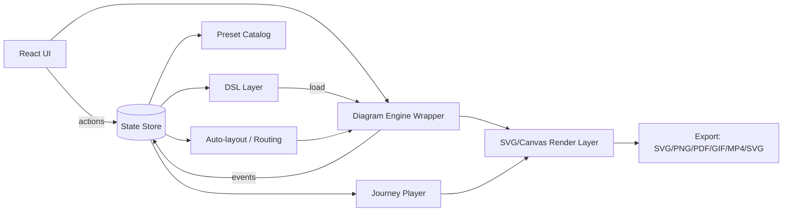

# C4 Editor & Journey Player (Web/React)

## 0) Vision

Build a draw.io/Whimsical-style editor with full product control, focused on:

- **C4 modeling** (`System`, `Container`, `Component`, and `Boundary`).
- **Internal container diagrams**, with **Hexagonal Architecture** as first-class support (`PortIn`, `PortOut`, `AdapterIn`, `AdapterOut`).
- **Journeys/flows** inside the same diagram (auto step numbering + per-journey color).
- **Render/Player mode** with edge flow animation, node/edge highlighting, end-of-journey effects, loop, and speed control.
- **Drill-down**: double-click a container to open its child view with breadcrumb navigation.
- Persistence strategy:
  - always save **FULL DSL/model** (with geometry),
  - support a **LITE DSL** for human/AI editing that is converted to FULL.

### Core principles

- Decouple UI, engine, and DSL layers.
- Keep schema-versioned data with explicit migrations.
- Avoid paid/proprietary lock-in.
- Preserve extensibility by adapter boundaries.

---

## 1) UX Layout (Editor)

### 1.1 Visual structure

1. **Topbar**
- current workspace/view + breadcrumb
- actions: save/export, grid/snap/theme, zoom, presentation mode, player controls

2. **Left sidebar (Palette/Toolbox)**
- C4: System, Container, Component, Boundary
- Infra: DB, Cache, Queue/Stream, API Gateway, Auth/Security, Observability
- Hex: Domain, Ports, Adapters, Application Service
- tools: Select, Hand/Pan, Connector, Label

3. **Canvas**
- infinite canvas with pan/zoom
- optional grid and snap
- selection and resize handles
- edge ports/handles for reliable connection docking

4. **Right sidebar / dock**
- Inspector and Journeys tabs
- supports dock repositioning (right/bottom)

5. **Bottom workbench**
- timeline and DSL tabs
- focus/maximize behavior for text workflows

### 1.2 Key interactions

- Drag from palette to create nodes.
- Connect by dragging from source handle to target handle.
- Edit node/edge metadata in inspector.
- Add edges to active journeys and control playback from player UI.

---

## 2) Render / Player Mode

### 2.1 Goal

Play a journey as a visual sequence of messages across architecture elements.

### 2.2 Controls

- journey selector
- loop on/off
- speed control
- play/pause, next/previous, reset
- node highlight toggle
- trail on/off (orb-only fallback)

### 2.3 Animation behavior

- moving orb follows edge path.
- optional trail and glow effects.
- destination highlight triggers on visual arrival.
- confetti/effect runs at journey completion.

### 2.4 Drill-down with player

When entering a child view:
- preserve active context when possible,
- stop/re-align playback if current journey does not apply to the new view.

---

## 3) High-Level Software Architecture



### Layer responsibilities

- **UI**: layout, forms, hotkeys, and command surfaces.
- **Store**: editor state, selection, viewport, journeys, playback state.
- **Engine adapter**: canonical operations for create/move/resize/connect/select.
- **DSL layer**: FULL canonical model + LITE conversion/parsing.
- **Presets**: node/tech/protocol catalogs.
- **Layout/routing**: optional auto-arrangement and edge routing.
- **Player**: step timeline and animation semantics.

---

## 4) Engine Strategy

### Option A: Modular SVG engine (recommended)

Why:
- precise SVG export,
- easier path-driven animation,
- full control over rendering and UX details.

### Option B: full graph engine (draw.io-like)

Why:
- mature graph editing behavior and tooling ecosystem.

Implementation rule:
- isolate engine behind a strict `EngineAdapter` contract.

---

## 5) Data Model (Engine-Agnostic)

### 5.1 Entities

- **Workspace**: metadata and settings.
- **View**: one C4/Hex scope.
- **Node**:
  - `id`, `kind`, `name`, `tech`, `bounds`, `ports`, `children`, `drilldownRef`
- **Edge**:
  - `id`, `from`, `to`, `protocolPresetId`, `label`, `route`, `style`
- **Journey**:
  - `id`, `name`, `color`, `steps[]`, playback settings

### 5.2 C4 rules

- Containers can point to component views.
- Systems can point to container views.
- Boundaries group nodes and can auto-fit bounds.

---

## 6) Presets and Opinionated Defaults

Catalog files should define:
- node presets (C4 + infra + hex)
- technology presets (icons + labels)
- protocol presets (HTTP/gRPC/Kafka/SQL/etc.)

Each preset should provide:
- default shape
- default style
- optional icon
- default label behavior

---

## 7) DSL Strategy

### 7.1 FULL model

- JSON-based canonical source of truth.
- includes geometry, style, view hierarchy, journeys, and settings.

### 7.2 LITE DSL (human/AI-friendly)

- text-based structure for architecture intent.
- no required geometry.
- converted to FULL by parser + resolver + layout.

### 7.3 Conversion flow

- parse LITE into AST
- resolve stable IDs
- apply presets
- compute layout
- generate FULL model

### 7.4 Schema migration

- require `schemaVersion`
- keep pure migration functions (`x.y -> x.z`)

---

## 8) Rendering and Export

### 8.1 Rendering layers

- base: nodes and edges
- interaction: selection and handles
- player overlay: orb, trail, glow

### 8.2 Export matrix

- static: `SVG`, `PNG`, `PDF`
- animated: `GIF`, `MP4`, animated `SVG`

### 8.3 Journey animation export requirements

- loop-safe full journey capture
- consistent speed and arrival timing
- preserve active theme background
- omit editing-only visuals (handles, grid)

---

## 9) Internal Hexagonal View

### 9.1 Canonical elements

- Domain core
- Application services
- PortIn / PortOut
- AdapterIn / AdapterOut
- supporting infra (DB/Kafka/HTTP)

### 9.2 Journey reuse

- journeys can map from container-level steps to internal views where modeled.

---

## 10) Persistence

### 10.1 Local storage

- debounced autosave
- explicit save on critical operations

### 10.2 File export

- always export canonical FULL model
- optional generated LITE text export

---

## 11) Suggested Tech Stack

- React + TypeScript + Vite
- Zustand + Immer
- Zod validation
- Monaco editor for DSL
- Vitest for unit tests
- Playwright for E2E (recommended future addition)

---

## 12) Suggested Monorepo Layout

```text
/apps/web
/apps/codex-gateway
/packages/model
/packages/dsl-lite
/packages/player
/packages/export
/packages/presets
```

---

## 13) Milestone Roadmap

- **M0** Bootstrap: app skeleton + state + canvas basics.
- **M1** Core nodes/edges: create/move/resize/connect.
- **M2** Grid/snap/ports.
- **M3** C4 + infra presets.
- **M4** Journeys and filters.
- **M5** Player and effects.
- **M6** C4 drill-down.
- **M7** Hex view.
- **M8** DSL LITE pipeline.
- **M9** Export pipeline.

---

## 14) Implementation Guidelines

### 14.1 Contract-first
1. Define model and schema contracts.
2. Integrate engine afterwards.

### 14.2 Command-based editing
- model changes should be explicit commands (future undo/redo readiness).

### 14.3 Stable identifiers
- deterministic IDs improve diff quality and future collaboration options.

### 14.4 Performance
- avoid full rerender on pointer move.
- avoid allocation-heavy per-frame loops.

### 14.5 Testing
- unit: DSL parsing, migrations, journey sequencing.
- E2E: editing, drill-down, playback, export smoke tests.

---

## 15) Risks and Mitigations

- Complex edge routing:
  - start simple and evolve orthogonal routing iteratively.
- Drill-down plus journeys:
  - keep strict per-view semantics and explicit fallbacks.
- Icon licensing:
  - use open/free icon sets with proper attribution.

---

## 16) Immediate Technical Next Step

Freeze and enforce `EngineAdapter` API:

- `createNode(presetId, x, y)`
- `moveNode(id, dx, dy)`
- `resizeNode(id, bounds)`
- `connect(fromPort, toPort, protocolPresetId)`
- `setEdgeRoute(id, points[])`
- events:
  - `onSelection`
  - `onDrag`
  - `onConnect`
  - `onResize`
  - `onViewportChange`

This keeps DSL, journeys, and player evolution independent from engine internals.
