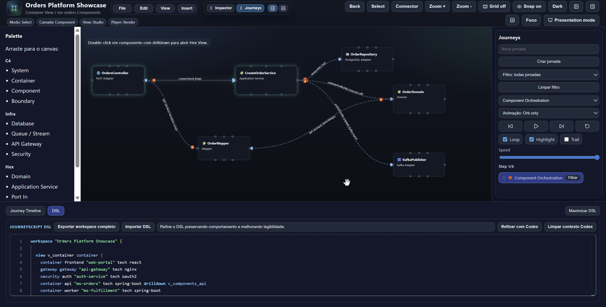
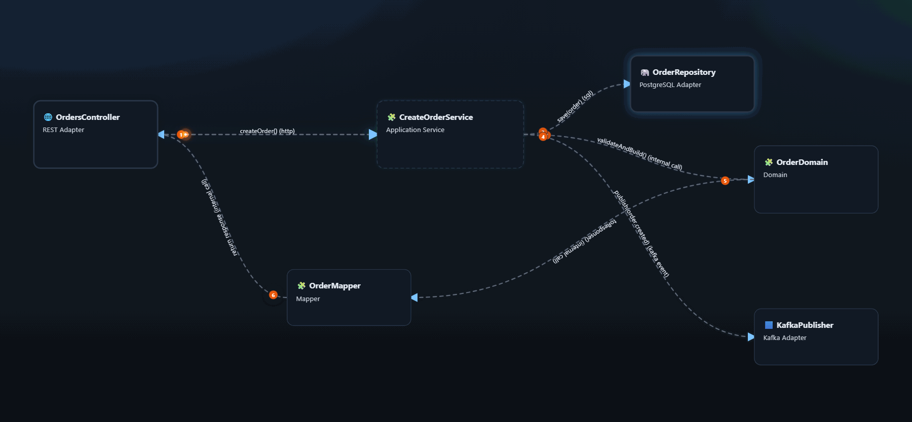

# System Journey Viewer

System Journey Viewer is an open-source visual editor to model architecture and execution journeys in a single artifact.

It supports multi-layer modeling (`Container`, `Component`, `Hex`), animated journey playback, and textual modeling through `JourneyScript` (DSL LITE).

## Highlights

- Visual architecture editor with ports, snap/grid, pan/zoom, and drill-down.
- Journey timeline and player with animated flow playback.
- Dockable workspaces (`Inspector`, `Journeys`, `Timeline`, `DSL`, `Help`) with right/bottom/floating layouts.
- `JourneyScript` DSL editor with Monaco-based syntax highlighting.
- Multi-format export: `SVG`, `PNG`, `PDF`, plus animated `GIF`, `MP4`, and animated `SVG`.
- Optional Codex-assisted DSL refinement through a secure gateway.
- Dark/light themes and presentation mode for demos.
- Built-in markdown Help panel and local recent-file memory (up to 3 workspace snapshots).

## Product Demo

> [!WARNING]
> The live walkthrough below was captured by an automated robot script.
> During capture playback, some UI elements may look temporarily misaligned.

### Static UI snapshot (recommended reference)



### Live UI walkthrough (captured from a running app)


- High-quality MP4: [`docs/readme-live-demo.mp4`](docs/readme-live-demo.mp4)

### Journey animation examples (exported from the editor)



- MP4 export example: [`docs/orders-platform-showcase-order-creation-sync-event.mp4`](docs/orders-platform-showcase-order-creation-sync-event.mp4)

## Repository Structure

- `apps/web`: React + Vite web editor.
- `apps/codex-gateway`: Node.js server-side gateway for Codex DSL assistance.
- `docs`: product and engineering documentation.

## Quick Start

### Prerequisites

- Node.js 20+
- npm 10+

### Install and run the web app

```bash
npm install
npm run dev
```

Default URL: `http://localhost:5173`

### Optional: run the Codex gateway

```bash
npm run dev:gateway
```

Default URL: `http://localhost:8787`

## Scripts

From repository root:

- `npm run dev`: start web app.
- `npm run dev:gateway`: start Codex gateway.
- `npm run lint`: run web lint.
- `npm run test:run`: run web tests once.
- `npm run test:run:gateway`: run gateway tests.
- `npm run build`: build web app.

## Deploy to Vercel

This repository is preconfigured for Vercel static deployment of the web app.

### 1. Import repository into Vercel

- Framework preset: `Vite`
- Root directory: repository root
- Build command: `npm run build`
- Output directory: `dist`

A `vercel.json` file is included with SPA rewrite support.

### 2. Optional environment variables

If you host the Codex gateway separately, expose it to the browser with:

- `CODEX_GATEWAY_URL`

If you deploy the gateway in another environment, use variables documented in `.env.example`.

### 3. Notes

- The web app can run without the gateway.
- DSL assist is optional and only used when the user triggers Codex refinement.

## Generate Demo Media with Playwright (Optional)

You can regenerate real UI demo media automatically.

1. Start the web app:

```bash
npm --workspace @sjv/web run dev -- --host 127.0.0.1 --port 4173
```

2. In another terminal, install Playwright browser runtime and run the capture script:

```bash
npm install --no-save playwright
npm exec playwright install chromium
DEMO_URL=http://127.0.0.1:4173 node scripts/capture-readme-demo.mjs
```

Generated files:

- `docs/readme-live-demo.webm`
- `docs/readme-live-demo.mp4`
- `docs/readme-live-demo.gif`

## Open Source and Community

- Contribution guide: `CONTRIBUTING.md`
- Code of conduct: `CODE_OF_CONDUCT.md`
- Security policy: `SECURITY.md`
- Support channels: `SUPPORT.md`
- License: `LICENSE`

## Documentation Map

- `docs/UI_JOURNEYS_CAPABILITIES.md`: UI usage guide and current capabilities.
- `docs/DSL_LITE_SPEC.md`: official DSL LITE grammar and semantics.
- `docs/DECISIONS.md`: architecture and product decisions.
- `docs/AI_STATE.md`: current implementation state snapshot.
- `docs/WORKLOG.md`: chronological engineering change log.
- `INTRUCTIONS.md`: implementation blueprint and roadmap.
- `AGENTS.md`: repository working rules for AI agents.
